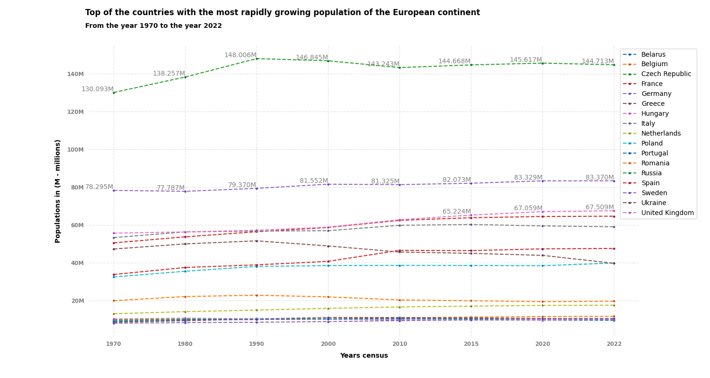
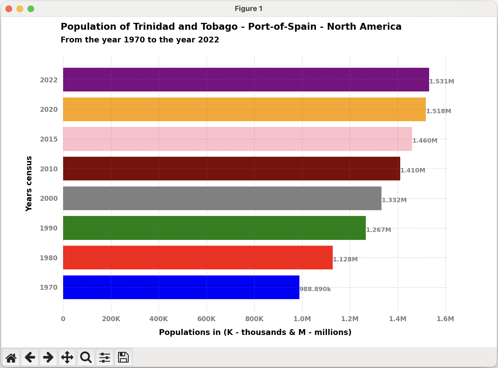
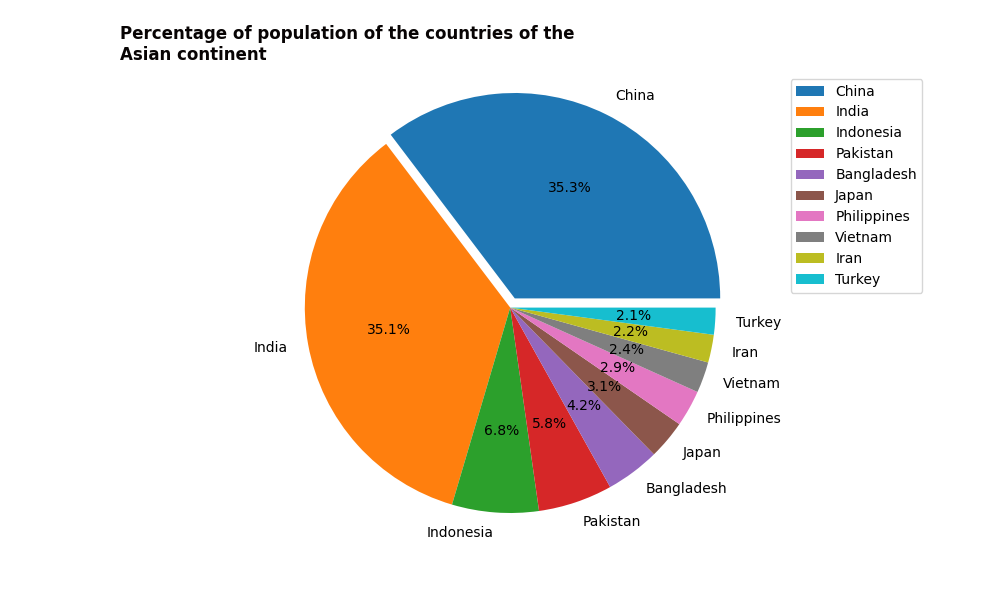
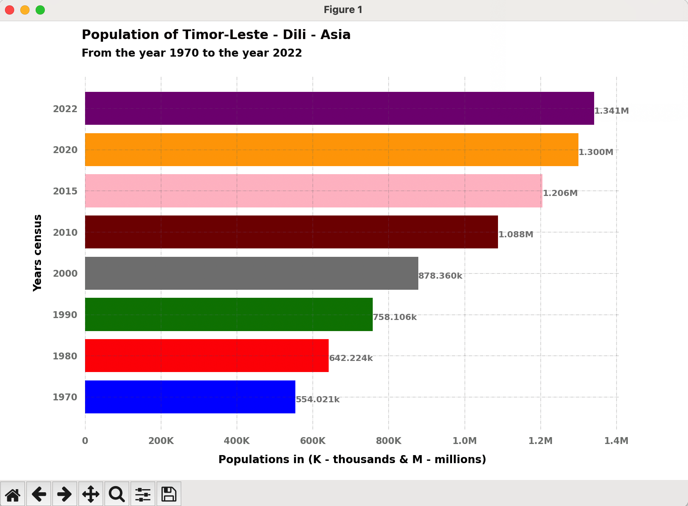
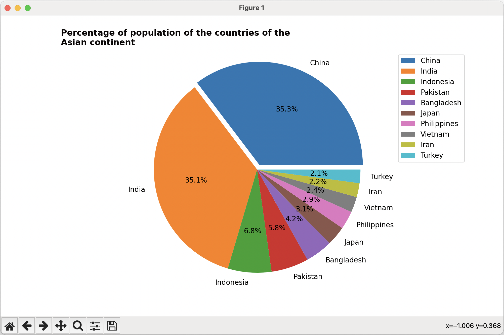

# World Demographics

This Python project provides a simple and effective visualization of the evolution of the world population over different years. It utilizes the `matplotlib` library to generate a line chart displaying population trends over time.

#### Requirements

Make sure you have Python installed. You can install the necessary dependencies by running:

#### Clone the repository
```sh
git clone https://github.com/brunomaldonado/World-Demographics.git
cd World-Demographics
python3 -m venv env
source env/bin/activate
pip3 install -r requirements.txt
python3 main.py
```

#### Run the script
```
(env) > python3 main.py
```

This will generate a chart showing the world population over the years.

Data by continent.
<p align="center">
  
</p>

Data countries.
<p align="center">
  
</p>

<p align="center">
  
&nbsp; &nbsp; &nbsp; &nbsp;
  
</p>

<p align="center">
  
&nbsp; &nbsp; &nbsp; &nbsp;
  
</p>

<!-- <table style="border:none; border:0; border-collapse:collapse;">
  <tr style="border:none; border:0; border-collapse:collapse">
    <td valign="center"  style="border:none; border:0; border-collapse:collapse"></td>
    <td valign="top" style="border:none; border:0; border-collapse:collapse"></td>
  </tr>
   <tr style="border:none; border:0; border-collapse:collapse">
    <td valign="top" style="border: none; border-collapse:collapse"></td>
    <td valign="top" style="border:none; border:0; border-collapse:collapse"></td>
  </tr>
</table> -->

<!-- |  [](https://i.postimg.cc/zBF91MgQ/timor-leste.png) | [](https://i.postimg.cc/59ksFbb3/united-arab-emirates.png)  |
| ------------ | ------------ |
| [](https://i.postimg.cc/mrXmNs7B/gibraltar.png)  |  [](https://i.postimg.cc/QCLk0xCG/asia.png) | -->

<!-- <table>
  <tr>
    <td valign="top"></td>
    <td valign="top"></td>
  </tr>
</table> -->


#### Customization
Feel free to customize the code to suit your specific needs. You can adjust population and year data in the main.py file according to your preferences.

#### Contributions
Contributions are welcome! If you find any issues or have suggested improvements, please open an issue or submit a pull request.

##### License
This project is licensed under the MIT License.

------------
> Creator: Rigoberto Bruno Maldonado.

