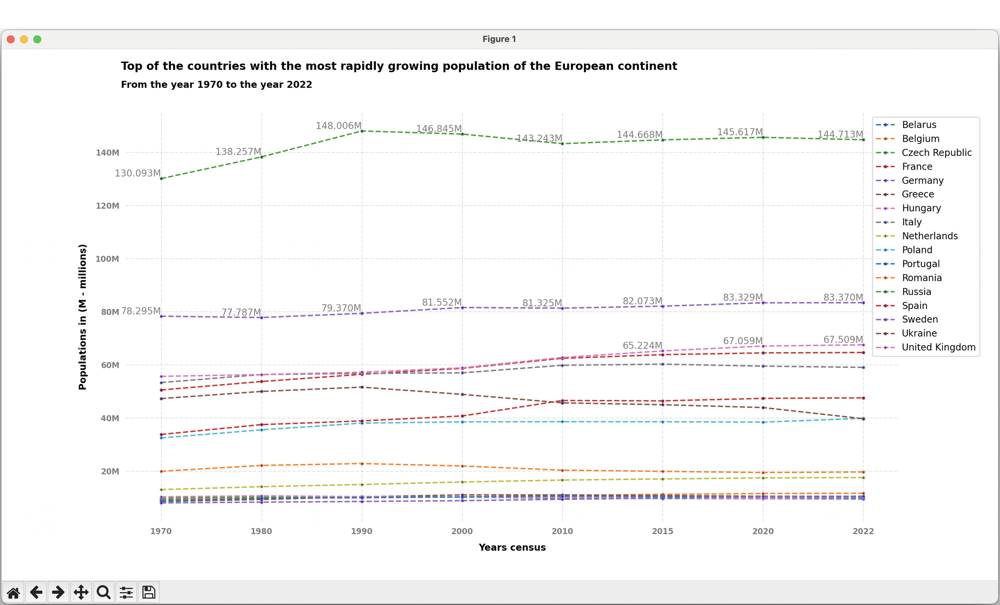

# World Demographics

This Python project provides a simple and effective visualization of the evolution of the world population over different years. It utilizes the `matplotlib` library to generate a line chart displaying population trends over time.

## Requirements

Make sure you have Python installed. You can install the necessary dependencies by running:
pip3 install -r requirements.txt

### Clone the repository
git clone https://github.com/brunomaldonado/World-Demographics.git

### Run the script
python3 main.py

This will generate a chart showing the world population over the years.

  

Customization
Feel free to customize the code to suit your specific needs. You can adjust population and year data in the main.py file according to your preferences.

Contributions
Contributions are welcome! If you find any issues or have suggested improvements, please open an issue or submit a pull request.

License
This project is licensed under the MIT License. See the LICENSE file for more details.

We hope you find this World Demographics tool in Python useful! If you have any questions or comments, feel free to get in touch. Thank you for contributing to the project!

Development.
Rigoberto Bruno

