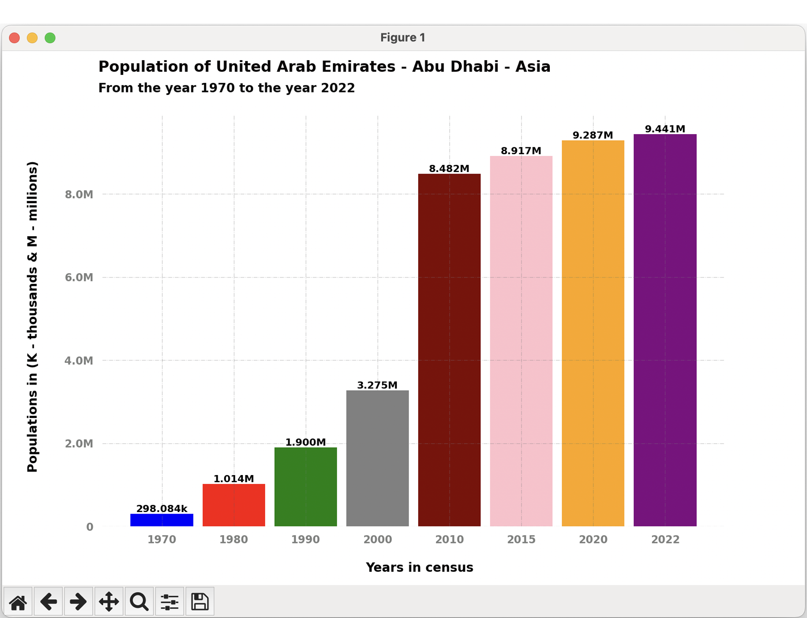

# World Demographics

This Python project provides a simple and effective visualization of the evolution of the world population over different years. It utilizes the `matplotlib` library to generate a line chart displaying population trends over time.

#### Requirements

Make sure you have Python installed. You can install the necessary dependencies by running:
- `pip3 install -r requirements.txt`

#### Clone the repository
- `git clone https://github.com/brunomaldonado/World-Demographics.git`

#### Run the script
- `cd World-Demographics `
- `python3 main.py`

This will generate a chart showing the world population over the years.

Data by continent.

  

Data countries.

  

<table>
  <tr>
    <td valign="top"></td>
    <td valign="top"></td>
  </tr>
</table>

<table>
  <tr>
    <td valign="top"></td>
    <td valign="top"></td>
  </tr>
</table>

<!-- 

  

  

 -->

#### Customization
Feel free to customize the code to suit your specific needs. You can adjust population and year data in the main.py file according to your preferences.

#### Contributions
Contributions are welcome! If you find any issues or have suggested improvements, please open an issue or submit a pull request.

##### License
This project is licensed under the MIT License.

------------
> Creator: Rigoberto Bruno Maldonado.

